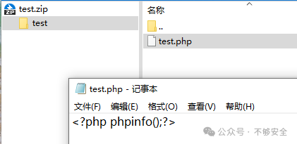
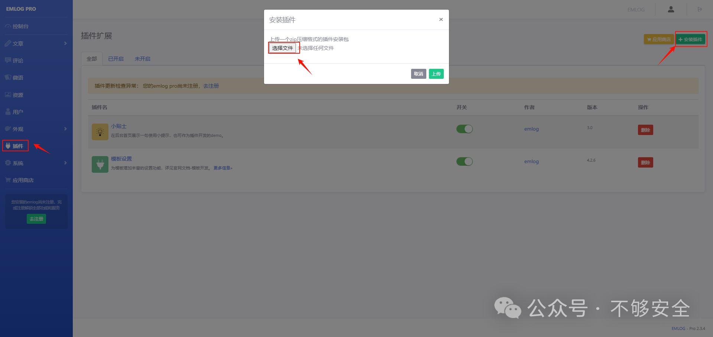

## emlog后台插件任意文件上传(CVE-2024-33752)

emlog 是一款基于 PHP 和 MySQL 的功能强大的博客及 CMS 建站系统，追求快速、稳定、简单、舒适的建站体验。


## fofa

```
app="EMLOG"
```


## poc

1.制作插件zip（zip内必须有一个文件夹）。



2.点击“插件-安装插件-选择文件”上传制作好的zip文件



3.然后访问下面链接，成功getshell。

```
http://192.168.243.175/content/plugins/test/test.php
```